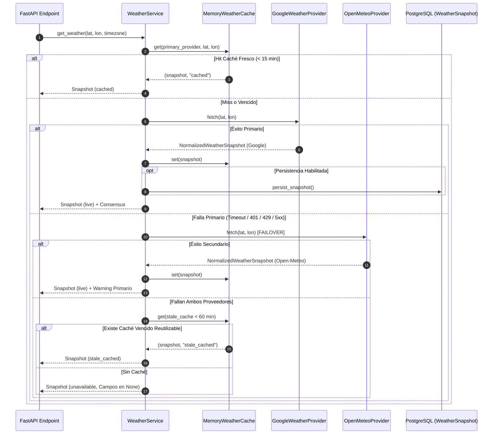

# 🌤️ Servicio Meteorológico Multiproveedor (EduAgro V2)

Módulo agrometeorológico asíncrono, multiproveedor, tolerante a fallos y con soporte para análisis de consenso y persistencia histórica en PostgreSQL.

---

## 🏗️ Arquitectura y Estructura del Módulo

El módulo se encuentra alojado en `app/services/weather/` y consta de los siguientes componentes:

```text
app/services/weather/
├── __init__.py                # Exportación del orquestador, modelos y funciones compatibles
├── config.py                  # Gestor de configuración y lectura de variables de entorno (.env)
├── models.py                  # Esquemas Pydantic v2 (NormalizedWeatherSnapshot, WeatherConsensus, etc.)
├── provider_base.py           # Protocolo abstracto WeatherProvider, httpx asíncrono y cálculo de agregados
├── open_meteo_provider.py     # Proveedor asíncrono de Open-Meteo
├── google_weather_provider.py # Proveedor asíncrono de Google Weather API (con sanitización de API key)
├── cache.py                   # Caché en memoria asíncrono thread-safe con soporte TTL y stale_cached
├── consensus.py               # Evaluador determinístico de discrepancias entre proveedores
├── weather_service.py         # Orquestador principal (Primary -> Secondary -> Stale Cache -> Unavailable)
├── compatibility.py           # Capa de compatibilidad retrocompatible con Jinja2 y endpoints legacy
└── README.md                  # Guía técnica y de arquitectura
```

---

## 🔄 Flujo de Ejecución (Primary / Secondary / Cache / Fallback)



---

## ⚙️ Variables de Entorno y Configuración (`.env`)

| Variable | Valor por Defecto | Descripción |
| :--- | :--- | :--- |
| `WEATHER_PRIMARY_PROVIDER` | `google_weather` | Proveedor principal (`google_weather` o `open_meteo`). |
| `WEATHER_SECONDARY_PROVIDER` | `open_meteo` | Proveedor secundario de respaldo. |
| `GOOGLE_MAPS_WEATHER_API_KEY` | `None` | API Key de Google Cloud Weather / Maps. (Acepta también `GOOGLE_API_KEY`). |
| `WEATHER_HTTP_TIMEOUT_SECONDS` | `5.0` | Timeout por petición HTTP asíncrona (segundos). |
| `WEATHER_HTTP_MAX_RETRIES` | `2` | Cantidad de reintentos acotados con backoff exponencial e jitter. |
| `WEATHER_CACHE_TTL_SECONDS` | `900` | Tiempo de vida (15 min) para considerar un caché como fresco. |
| `WEATHER_STALE_CACHE_MAX_AGE_MINUTES` | `60` | Antigüedad máxima (1 hora) para reutilizar un caché vencido ante fallas. |
| `WEATHER_ENABLE_PERSISTENCE` | `true` | Guarda snapshots en la tabla `weather_snapshots` de PostgreSQL. |
| `WEATHER_CONSENSUS_ENABLED` | `true` | Evalúa discrepancias de pronóstico entre primario y secundario. |
| `WEATHER_CONSERVATIVE_ON_DISAGREEMENT` | `true` | Sugiere modo de decisión conservador ante altas diferencias. |

---

## 🔑 Habilitación y Restricción de Google Weather API en Google Cloud

1. Iniciar sesión en [Google Cloud Console](https://console.cloud.google.com/).
2. Crear o seleccionar el proyecto de la organización EduAgro.
3. Ir a **APIs & Services > Library** y buscar **Google Weather API** (o **Google Maps Platform / Environmental APIs**).
4. Hacer clic en **Enable**.
5. Ir a **Credentials**, seleccionar la API Key o crear una nueva.
6. **Restricciones recomendadas (Seguridad):**
   * **API Restrictions:** Restringir la clave únicamente a *Google Weather API*.
   * **Application Restrictions:** Restringir por IP de servidor VPS si aplica.
7. Copiar la clave generada y agregarla en el archivo `.env` del servidor:
   ```env
   GOOGLE_MAPS_WEATHER_API_KEY=AIzaSy...
   ```

> [!CAUTION]
> El sistema redacta automáticamente la API Key (`[REDACTED]`) en logs, errores y representaciones JSON para evitar filtraciones imprevistas. Nunca subas el archivo `.env` a Git.

---

## 📊 Política ante Datos Faltantes y Discrepancias (Consenso)

1. **Datos Faltantes (No Datos Ficticios):**
   * Si ambos proveedores fallan y no existe caché, el estado se marca como `"unavailable"`.
   * **Todos los campos climáticos numéricos retornan `None`** (no se utilizan datos hardcodeados ficticios como 22.5 °C o 14 km/h en producción).
2. **Evaluación de Discrepancia:**
   * Se comparan las precipitaciones acumuladas a 72h, viento máximo y temperatura mínima entre Google Weather y Open-Meteo.
   * Si la diferencia en precipitación es $\ge 15\text{ mm}$ o viento $\ge 15\text{ km/h}$, la discrepancia se clasifica como `high` y se sugiere el modo `verify_in_field`.
   * **No se realiza un promedio automático** entre predicciones contrapuestas para preservar la integridad de los datos.

---

## 🧪 Ejecución de Pruebas Unitarias

La suite de pruebas utiliza `pytest`, `pytest-asyncio` y `respx` para simular respuestas HTTP sin llamar a servicios reales en tests.

Para ejecutar los tests:

```bash
PYTHONPATH=. ./venv/bin/pytest tests/test_weather_service.py -v
```

---

## 🚀 Migración Futura a Redis

La clase `MemoryWeatherCache` implementa la abstracción `WeatherCache`. Para migrar a Redis en el futuro:
1. Crear `RedisWeatherCache` en `app/services/weather/cache.py` utilizando `redis-py` asíncrono.
2. Inyectar `RedisWeatherCache` en `WeatherService(cache=...)` sin modificar ningún controlador ni plantilla.

---

## 📜 Plan de Depreciación de `clima_fetcher.py`

Las funciones legadas en `app/services/fetchers/clima_fetcher.py` y `app/services/clima.py` han sido convertidas en **fachadas asíncronas y sincrónicas** que delegan internamente en `WeatherService`. Los endpoints de FastAPI invocan la versión asíncrona `await obtener_clima_para_campo_async(...)`.
