# Auditoría Técnica y Funcional: Comercial, Servicios, Arrendamientos, Stock en Acopio y Maquinaria

**Proyecto:** EduAgro  
**Fecha de Auditoría:** 21 de Agosto de 2026  
**Auditor Lead:** Product Architect & Senior Codebase Auditor (FastAPI / SQLAlchemy AsyncIO / Jinja2)  
**Estado:** Documento Oficial de Auditoría y Planificación  

---

## 1. Inventario Real del Repositorio

| Tema | Modelos existentes | Rutas / UI existentes | Reglas / Cálculos existentes | Tests | Estado |
|---|---|---|---|---|---|
| **Módulo Comercial (Resumen & Dashboard)** | `ContratoVentaGrano`, `CompromisoGrano`, `StockGrano` (legacy), `PrecioMercadoCache` | `GET /comercial` (`templates/comercial_resumen.html`) | `calcular_posicion_comercial` (`app/services/comercial.py`), Sparklines, Cotizaciones Matba Rofex | `tests/test_stock_1b_domain_and_persistence.py`, `tests/test_commitment_labels.py` | Parcialmente implementado (Redundante y desalineado con Stock 1A/1B/1C) |
| **Stock Físico V1 / 1B / 1C** | `StorageLocation`, `StockPartida`, `StockMovement`, `StockQualityMeasurement`, `StockReservation`, `StockDeliveryAllocation`, `StockWeightReconciliation` | `GET /comercial/stock` (`templates/comercial_stock.html`), modales de reservas, asignaciones, mediciones, ubicaciones | `get_stock_partida_balance`, `fetch_aggregated_stock_v1_summary`, `confirm_delivery_dispatch`, `record_delivery_reception_and_reconciliation`, `resolve_weight_reconciliation` | `tests/test_stock_v1.py`, `test_stock_1b_domain_and_persistence.py`, `test_stock_1c_dispatch_and_reconciliation.py`, `test_waybill_reception_flow.py` | Implementado y operativo (100% verificado) |
| **Entregas, Fletes y Cartas de Porte** | `FreightQuote`, `GrainDelivery`, `GrainWaybill` | `GET /comercial/fletes`, `GET /comercial/entregas` (`templates/comercial_fletes.html`, `comercial_entregas.html`) | Cotización de fletes, despacho físico único, recepción con balanza de destino | `tests/test_stock_1c_dispatch_and_reconciliation.py`, `test_waybill_reception_flow.py` | Implementado y operativo (100% verificado) |
| **Compromisos Comerciales** | `CompromisoGrano` | `GET /comercial/contratos` (`templates/comercial_contratos.html`), modales de creación y selección en stock/entregas | `build_commitment_display_label`, `get_compromisos_saldos_map`, cálculo de saldos y vencimientos | `tests/test_commitment_labels.py` | Implementado y operativo |
| **Facturas de Servicios / Gastos** | `ServicioInstalado`, `ServicioVencimiento` | `GET /servicios` (`templates/servicios_instalaciones.html`) | Cálculo de totales ARS/USD, estados AL_DIA / PENDIENTE / VENCIDO | No cuenta con test suite dedicado | Existe como UI con persistencia parcial (Columna `comprobante_url` en BD sin upload handler ni almacenamiento seguro) |
| **Arrendamientos por Campo** | `CompromisoGrano` (con `campo_id` y `tipo_compromiso="alquiler_arrendamiento"`) | Formularios en `/comercial/contratos` y `/comercial/stock` | Control de entrega de grano en toneladas contra el compromiso de alquiler | Integrado en `tests/test_commitment_labels.py` | Existe como modelo parcial sin entidad Contrato |
| **Stock Entregado en Custodia / Acopio** | `StorageLocation` (`tipo="acopio"`), `StockPartida` | Pestaña "Ubicaciones de Guarda" en `/comercial/stock` | Agregación de stock por tipo de ubicación (Silo, Silobolsa, Acopio) | Integrado en `tests/test_stock_capacity_and_location_crud.py` | Existe como modelo sin flujo de transferencia directa |
| **Capital / Maquinaria** | Ninguno (`Base` sin tablas de maquinaria o activos) | Únicamente referencias en texto estático y disclaimers | Ninguna | Ninguno | No implementado |

---

## 2. Auditoría del Módulo Comercial (`/comercial`)

### Diagnóstico Técnico y Redundancias Detectadas
1. **Desalineación con Stock 1A/1B/1C**: La vista `/comercial` (Resumen) llama a `calcular_posicion_comercial` (`app/services/comercial.py`), el cual consulta la tabla **legacy** `StockGrano` (columna `toneladas_almacenadas`) para calcular el stock acumulado. En cambio, la vista `/comercial/stock` opera con el nuevo estándar **Stock 1A/1B/1C** (`StockPartida` y `StockMovement`). Esto genera diferencias en los números presentados entre el Resumen y la Grilla de Stock Físico.
2. **Mezcla de Datos Teóricos vs. Reales**:
   - **Producción Estimada/Teórica**: Calculada en vivo multiplicando `superficie_productiva_ha * (qq_ha_real or qq_ha_estimado) / 10`.
   - **Ventas**: Derivadas de `ContratoVentaGrano` (`tipo_precio="fijo"` vs `tipo_precio="a_fijar"`).
   - **Compromisos**: Derivados de `CompromisoGrano` con `cumplido=False`.
   - **Precios de Mercado**: Obtiene snapshot de cotizaciones (`PrecioMercadoCache`) y los cruza con Matba Rofex.
3. **Falta de Entradas para la Toma de Decisiones**:
   - El orquestador `evaluar_motor_decisiones` es invocado en `/comercial` utilizando valores hardcodeados por defecto (`humedad_ini = 17.5`, `costo_secada_punto_usd = 2.50`, `temp_min_c = 10.0`), sin utilizar los datos reales de calidad de las partidas ni los costos reales cargados por el usuario.

### Propuesta de UI Mínima y Despejada para `/comercial`
Reducir las múltiples cards redundantes a **5 bloques operativos clave**:

```text
+-----------------------------------------------------------------------------------+
| 1. KPIs PRINCIPALES (4 métricas ejecutivas)                                       |
|    - Producción Total Estimada (Tn)                                               |
|    - % Cobertura Comercial (Vendidas + Comprometidas / Producción)                |
|    - Stock Físico Libre Disponible (Tn en Silobolsas + Acopio)                    |
|    - Valorización Estimada del Stock Libre (USD)                                  |
+-----------------------------------------------------------------------------------+
| 2. PRIORIDADES DE HOY (Sugerencias accionables del Motor)                         |
|    - [Estrategia Venta] Ej: "Vender 50 Tn Trigo Spot - Matba por encima de objetivo" |
|    - [Alerta Logística] Ej: "Cierre de Acopio por lluvia en 48hs"                 |
+-----------------------------------------------------------------------------------+
| 3. COMPROMISOS PRÓXIMOS (Vencimientos a < 30 días)                                |
|    - Lista de arrendamientos y canjes con barra de progreso de stock reservado    |
+-----------------------------------------------------------------------------------+
| 4. STOCK DISPONIBLE VS. COMPROMETIDO (Gráfico de barras apiladas)                |
|    - Físico en Silo/Bolsa | Físico en Custodia | Reservado | Disponible Libre   |
+-----------------------------------------------------------------------------------+
| 5. ALERTAS OPERATIVAS & LOGÍSTICAS                                                |
|    - Entregas en tránsito sin confirmación de pesaje en destino                   |
|    - Cartas de porte pendientes de documentación                                  |
+-----------------------------------------------------------------------------------+
```

---

## 3. Auditoría de Facturas de Servicios

### Estado Actual del Código
- **Modelos**: `ServicioInstalado` y `ServicioVencimiento` poseen la columna `comprobante_url: Mapped[Optional[str]] = mapped_column(Text, nullable=True)`.
- **Almacenamiento y Carga**: **NO EXISTE** handler de upload (`UploadFile`), servicio de almacenamiento en disco/S3, ni ruta para servir archivos descargables.
- **Riesgos de Seguridad Detectados**:
  1. Si un usuario ingresara una URL arbitraria en la base de datos, no hay validación de formato, tamaño ni tipo MIME.
  2. Al no contar con un endpoint de descarga autenticado con verificación de `cliente_id`, cualquier archivo almacenado públicamente en el VPS quedaría expuesto si se conoce la ruta.

### Propuesta de Alcance Mínimo Útil (V1)
Implementar la adjunción de comprobantes sin construir un gestor documental complejo:

1. **Almacenamiento Local Seguro en VPS**:
   - Guardar archivos en un directorio no público: `uploads/servicios/{cliente_id}/{servicio_id}/`.
2. **Metadatos y Validaciones (Upload Handler)**:
   - Validar extensión y tipo MIME estrictos: `.pdf`, `.jpg`, `.jpeg`, `.png`.
   - Limitar tamaño máximo: 10 MB por archivo.
   - Guardar nombre original sanitizado, tamaño en bytes y fecha de subida.
3. **Endpoint Protegido de Descarga**:
   - Ruta `GET /servicios/{servicio_id}/comprobante` que verifica autenticación y ownership (`servicio.cliente_id == user.cliente_id`) antes de retornar el archivo mediante `FileResponse`.

---

## 4. Auditoría de Contratos de Arrendamiento por Campo

### Estado Actual del Código
- **Modelo Actual**: `CompromisoGrano` posee la columna `campo_id: Mapped[Optional[uuid.UUID]] = mapped_column(ForeignKey("campos.id"))` y soporta el enumerado `tipo_compromiso = TipoCompromisoEnum.ALQUILER_ARRENDAMIENTO`.
- **Integración Operativa Existente**: Funciona correctamente para reservar stock físico (`StockReservation`), asignar stock a entregas (`StockDeliveryAllocation`) y descontar grano contra un contrato de alquiler.

### Deficiencias y Gaps Identificados
1. **Unidad Exclusiva en Toneladas (Tn)**: El modelo actual sólo almacena `toneladas_comprometidas`. En la realidad agropecuaria argentina, los alquileres se pactan comúnmente en:
   - **Quintales por Hectárea (qq/ha)** (ej. 12 qq/ha de soja sobre 150 ha = 180 Tn totales).
   - **Pesos (ARS) o Dólares (USD) fijos** por hectárea o por campo.
   - **Modalidad A Porcentaje / Aparcería** (ej. 20% de la cosecha rendida).
2. **Ausencia de Entidad "Contrato Marco"**: Un arrendamiento anual suele tener múltiples fechas de vencimiento (ej. 50% en Mayo tras la cosecha gruesa y 50% en Octubre). Actualmente, el usuario debe crear manualmente `CompromisoGrano` independientes para cada cuota.

### Propuesta de Arquitectura Sin Duplicar Módulos
Reutilizar `CompromisoGrano` como la **obligación operativa de entrega**, agregando opcionalmente un modelo liviano `ContratoArrendamiento`:

```text
[Campo] 1 --- * [ContratoArrendamiento] 1 --- * [CompromisoGrano] (Cuotas u obligaciones en Tn)
                                                       |
                                                       +--- * [StockReservation] (Reservas de stock)
```

- **Calculadora en Formulario**: Al crear un contrato de arrendamiento por campo, la UI calculará automáticamente las toneladas totales:  
  $$\text{Tn Totales} = \frac{\text{Superficie (ha)} \times \text{Alquiler (qq/ha)}}{10}$$
- Generará los registros `CompromisoGrano` correspondientes a cada fecha de pago/vencimiento.

---

## 5. Auditoría de Stock en Acopio / Custodia de Terceros

### Estado Actual del Código
- **Modelos**: `StorageLocation` soporta `tipo="acopio"`, y `StockPartida` permite asociar grano almacenado a dicha ubicación.
- **Visualización**: La grilla de `/comercial/stock` agrupa el stock acumulado diferenciando `Silo`, `Silobolsa` y `Acopio`.
- **Trazabilidad de Entregas (Stock 1C)**: Al despachar un camión con `GrainDelivery` hacia un acopio (ej. AFA Maciel), el stock físico de la partida propia (ej. Silobolsa 4) se descuenta exactamente una vez por el neto de origen.

### Gap Específico Detectado (El Nudo Operativo)
Cuando el cereal sale de un silobolsa propio y se entrega en un acopio en modalidad **"En Custodia / A Fijar Precio"** (sin venderse inmediatamente):
1. **Se descuenta el silobolsa propio** (correcto, el grano físicamente salió del campo).
2. **Falta la entrada automática en la ubicación de Acopio**: No se crea automáticamente la `StockPartida` correspondiente en el `StorageLocation(tipo="acopio")` para reflejar que esa cantidad ahora está físicamente en custodia del tercero.
3. **Metadatos de Custodia Faltantes**: No existen campos para registrar el *Número de Certificado de Depósito / Fianza*, la *Tarifa de Almacenaje/Paritaria*, ni el *Estado de Fijación de Precio*.

### Solución Recomendada (Sin Transferencias Complejas)
Permitir que al confirmar la recepción de una entrega cuyo destino es un acopio con modalidad "custodia", el sistema opcionalmente registre la entrada de una `StockPartida` en la ubicación de acopio seleccionada.

---

## 6. Auditoría del Módulo de Capital y Maquinaria

### Estado Actual del Código
- **Diagnóstico**: **0% Implementado**. No existen tablas (`Base`), esquemas Pydantic, servicios en `app/services/` ni vistas Jinja2 para maquinarias, vehículos, tractores o mantenimiento de equipos.

### Propuesta de Alcance V1 Mínimo Útil
Diseñar un modelo simple y práctico para el productor familiar sin incurrir en la complejidad de contabilidad patrimonial o amortizaciones tributarias:

1. **Modelo `ActivoMaquinaria`**:
   - `id`, `cliente_id`, `campo_id` (opcional).
   - `nombre` (ej. "Tractor John Deere 6125M"), `categoria` (`tractor`, `cosechadora`, `sembradora`, `pulverizadora`, `camioneta`, `implemento`).
   - `marca`, `modelo`, `anio_fabricacion`, `patente_serie`.
   - `valor_compra_usd`, `fecha_adquisicion`, `valor_estimado_actual_usd`.
   - `horometro_km_actual` (contador de horas o kilómetros).
   - `estado` (`operativo`, `en_mantenimiento`, `fuera_de_servicio`).
2. **Modelo `EventoMantenimientoMaquinaria`**:
   - `id`, `maquinaria_id`, `fecha`, `tipo` (`preventivo`, `correctivo`, `service_programado`, `repuesto`).
   - `descripcion_trabajo`, `taller_proveedor`, `costo_total_ars`, `costo_total_usd`.
   - `comprobante_url` (enlace al comprobante PDF/imagen del service).

---

## 7. Plan de Cierre Priorizado para Hoy

A continuación se proponen los **tres entregables únicos de máximo impacto** que pueden desarrollarse hoy, ordenados por valor funcional para la familia, bajo riesgo técnico y reutilización del código existente:

```mermaid
gantt
    title Plan de Cierre Priorizado para Hoy
    dateFormat  HH:mm
    axisFormat %H:%M
    section Entregables
    1. Rediseño Ejecutivo Dashboard Comercial  :active, e1, 00:00, 3h
    2. Gestor Seguro de Comprobantes de Servicios :e2, after e1, 2.5h
    3. Vinculación de Arrendamiento por Campo      :e3, after e2, 2.5h
```



---

### Entregables Priorizados

#### Entregable 1: Rediseño Ejecutivo y Sincronización del Dashboard Comercial (`/comercial`)
- **Alcance Exacto**:
  - Reemplazar las consultas legacy a `StockGrano` por la agregación real de `StockPartida` / `StockMovement` (Stock 1A/1B/1C).
  - Limpiar la vista `templates/comercial_resumen.html` estructurándola en los 5 bloques ejecutivos (KPIs principales, Prioridades del día, Próximos compromisos, Stock disponible vs reservado, Alertas logísticas).
  - Alimentar el Motor de Decisiones con los datos reales de calidad de partidas y lotes.
- **Reutiliza**: `fetch_aggregated_stock_v1_summary`, `evaluar_motor_decisiones`, `comercial_tabs.html`.
- **Excluye**: Creación de nuevos módulos de mercado o contratos de futuros.
- **Tests Mínimos**: 4 unit tests para verificación de la posición comercial sincronizada con Stock 1C.
- **Riesgo**: Bajo.
- **Estimación**: **Medium (M)** (~3 horas).

---

#### Entregable 2: Gestor Seguro de Comprobantes y Adjuntos de Servicios (`/servicios`)
- **Alcance Exacto**:
  - Implementar handler de subida de archivos `UploadFile` en FastAPI para `ServicioInstalado` y `ServicioVencimiento`.
  - Guardar archivos en storage local sanitizado: `uploads/servicios/{cliente_id}/{servicio_id}/`.
  - Endpoint de descarga segura `GET /servicios/{servicio_id}/comprobante` con control estricto de `cliente_id`.
  - Agregar botón de subida y visualización de adjunto en `templates/servicios_instalaciones.html`.
- **Reutiliza**: Modelos `ServicioInstalado` y `ServicioVencimiento`, columna `comprobante_url`.
- **Excluye**: Integración con S3 o gestor documental complejo fuera del VPS.
- **Tests Mínimos**: 5 tests para comprobación de subida, validación de tipo MIME/tamaño, aislamiento tenant y descarga.
- **Riesgo**: Bajo.
- **Estimación**: **Medium (M)** (~2.5 horas).

---

#### Entregable 3: Calculadora y Vinculación de Contratos de Arrendamiento por Campo (`/comercial/contratos`)
- **Alcance Exacto**:
  - Extender la creación de `CompromisoGrano` para incluir la opción de cálculo automático en quintales por hectárea ($\mathrm{qq/ha}$) seleccionando un `Campo`.
  - Formatear adecuadamente las etiquetas de los contratos de alquiler indicando el campo asociado y el volumen proyectado.
  - Reflejar en el resumen del campo el nivel de cumplimiento de los contratos de arrendamiento.
- **Reutiliza**: Modelo `CompromisoGrano`, `campo_id`, `build_commitment_display_label`, `templates/comercial_contratos.html`.
- **Excluye**: Múltiples monedas avanzadas o contratos de aparcería complejos.
- **Tests Mínimos**: 4 tests unitarios de cálculo de arrendamiento y generación de compromisos por campo.
- **Riesgo**: Bajo.
- **Estimación**: **Small (S)** (~2 horas).

---

## 8. Preguntas Pendientes de Negocio

Para resolver cuestiones de diseño que no pueden deducirse únicamente del código, se formulan únicamente **tres preguntas clave en lenguaje de negocio**:

1. **Sobre la Modalidad de Pago de Alquileres de Campo**:  
   *¿Los contratos de arrendamiento de la familia se pagan habitualmente fijando una cantidad fija de quintales de soja a entregar en acopio, o se liquidan en pesos/dólares según la cotización del día del pago?*

2. **Sobre el Cereal en Custodia de Acopios**:  
   *Cuando envían camiones al acopio sin vender (grano a fijar/custodia), ¿necesitan llevar el saldo de grano en acopio separado por cada acopio (ej. AFA Maciel vs. Murature), o les basta con ver un total general de stock fuera del campo?*

3. **Sobre el Control de Maquinaria Agrícola**:  
   *Para los tractores y herramientas, ¿el objetivo prioritario es registrar los gastos de repuestos/services para saber cuánto cuesta mantener cada máquina, o necesitan controlar las horas de uso y vencimientos de insumos (aceites/filtros)?*

---

## 9. Verificación de Seguridad y Estado de Git

```bash
$ git status
En la rama develop
Tu rama está actualizada con 'origin/develop'.

Cambios no rastreados para el commit:
	modificados:     app/main.py
	modificados:     app/services/stock_service.py
	modificados:     templates/comercial_contratos.html
	modificados:     templates/comercial_entregas.html
	modificados:     templates/comercial_fletes.html
	modificados:     templates/comercial_resumen.html
	modificados:     templates/comercial_stock.html

Archivos sin seguimiento:
	docs/audits/commercial-services-rent-capital-audit.md
	docs/qa/qa-mock-cleanup-report-20260821-110656.md
	docs/qa/qa-mock-cleanup-report-20260821-110705.md
	docs/qa/qa-mock-cleanup-report-20260821-110714.md
	docs/qa/qa-mock-cleanup-report-20260821-110744.md
	scripts/cleanup_qa_mock_data.py
	templates/components/comercial_tabs.html
	tests/test_qa_mock_cleanup.py
	tests/test_waybill_reception_flow.py
```

> [!NOTE]  
> Se confirma que **ningún código de la aplicación, modelo, ruta, template o archivo `.env` ha sido modificado** durante la elaboración de esta auditoría. Únicamente se ha generado el informe oficial en `docs/audits/commercial-services-rent-capital-audit.md`.
